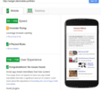

## Running the app

Download the zip file and extract to a folder of your choosing.  Src has all of the source files and dist is the build folder.  There are a few gulp commands that you can use to make your life easier:

 * gulp - run a webserver, open the page, and watch/lint JS, CSS, HTML on save
 * gulp build - optimize HTML, CSS, JS, and images and place in dist folder
 * gulp speed - run a pagespeed insights test in the command line (update the LINK constant in gulpfile.js with the url to your site)

## Changes that I made
### The Portfolio

* Added Web Font Loader to speed up fonts
* Created src and dist folders to separate code
* Minified all CSS, JS, and HTML
* Resized images closer to display size
* Optimized images with imagemin
* Inlined style.css with gulp-inline-source

### Pizza Shop
* Changed makeRandomPizza to return an array of ingredients (innerHTML was causing too much parsing)
* Previous change made Itemizer unnecessary - removed
* Refactored pizzaElementGenerator
 - removed 'pizza' from vars for clarity
 - grouped like commands
 - changed to more efficient methods(className, innerText)
 - added loop to replace Itemizer (creates and appends li element for each ingredient)
* Moved sizeSwithcer functionality into changeSliderLabel
* Refactor changePizzaSizes to not Query the DOM so frequently
* Refactor updatePositions for 60fps
 - moved scrollTop so it is only called once per function call
 - made an array of the 5 values rather than calculate them in the loop
 - used style.transform for speed in place of style.left
